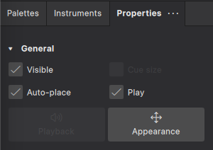
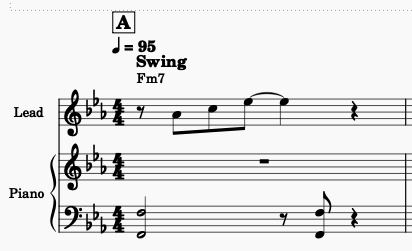

# Learn to Write Your Own Sheet Music

June 10, 2025 (or June 17, 2025)

## Description

Have you ever wanted to compose your own music or bring your musical ideas to life? Please join for an exciting workshop where you’ll learn to write your own sheet music using MuseScore, a powerful and user-friendly music notation software (which is completely free to use!). Whether you're a beginner or have some experience with music, this class will guide you step-by-step through the process of creating professional-quality sheet music.​

## Overview

In the lesson today, we're going to go over how to use the free and open-source, cross-platform program [MuseScore](https://musescore.org/en) to create professional quality sheet music. MuseScore is a fantastic program because it allows you to input notes through multiple methods:

- by clicking the note length and what note you want directly on the staff
- with shortcuts, numbers to set note lengths, letters for note names, and **[ctrl]**/**[cmd]** + **[up]**/**[down]** arrows to move the note an octave up or down
- and by plugging in a USB MIDI keyboard, clicking the note length, and playing the note you want to add

It also allows you to play back the audio you've created in excellent quality; either using the default built-in sounds or downloading better sounds through their Muse Hub app.

Additionally, you can format the document how you want, add articulations and dynamics, and more

Let's get started!

## 0. Downloading and installing MuseScore

First, visit the [releases page from the MuseScore GitHub repository](https://github.com/musescore/MuseScore/releases/tag/v4.4.4) and, under Assets, download the file that corresponds with your operating system.

> For example, if you're running 64-bit Windows 10 or 11, download the file named `MuseScore-Studio-4.4.4.243461245-x86_64.msi`. If you don't have administrator privaleges on your computer, download `MuseScore-Studio-4.4.4.243461245-x86_64.paf.exe`.
>
> If you're on a Mac computer, download `MuseScore-Studio-4.4.4.243461245.dmg`.

Once you've downloaded the file, just install it (or drag the app to `/Applications` on Mac) and you're all set!

## 1. Score properties

After going through the welcome information, click on the **Scores** tab on the left-hand side of the screen and click **New Score** under the rectangle with a plus icon on it. This will bring up the **New Score** dialog box.

From here, everything we do is dependent on what you want to make. However, if you want to just follow along and create the same score I'm creating, just do exactly what I do.

### Choose instruments

I'm going to get started by adding two different piano parts to the score by clicking **Keyboards** on the left under **Family**, **Piano** in the middle under **Instruments**, and pressing the arrow in the middle next to it twice. You should see two **Piano** parts on the right under **Your Score**.

Then click next.

### Set score properties

On the next dialog, you can set the information about your score. I set the following:

- **Key Signature**: E♭ major
- **Tempo**: 95
- **Measures**: 16
- **Title**: Example Sheet Music
- **Composer**: Christopher Wright

After that, click **Done**.

## 2. Score layout

Next, we're going to adjust the names of our instruments, what clefs are shown, the number of measures per line, and removing unneccessary information from our titles.

### Change instrument names

The first thing we're going to do is rename our instrument tracks.

On the left-hand side of the screen, click **Instruments**. You can adjust the instrument names by clicking the cog icon next to each instrument. Let's set the following:

- **Piano 1**
  - **Name on main score**: Lead
  - **Abbreviated name**: (Delete the text and leave empty)
- **Piano 2**
  - **Name on main score**: Piano
  - **Abbreviated name**: (Delete the text and leave empty)

The score should look like this now. It's just generally cleaner to read, as far as my tastes go.

### Delete bass clef from Lead instrument

Because I'm not planning on using the bass clef for the **Lead** instrument, I'm going to remove it. We can do this by pressing the arrow next to **Lead** under in the **Insruments** side panel, clicking the **Bass clef** from the list, and pressing the trash can icon from above it.

Now you should see only the treble clef for the **Lead** instrument and the treble and bass clefs for the **Piano** instrument underneath.

### Set system breaks

To make the notes easier to read for our final product, I want to show two measures per line. We can easily set this by going to **Format** in the menu bar and clicking **Add/remove system breaks...**. In the dialog box that appeared, change the `4` to a `2` and press **OK**.

Now our score should be formatted the way we want.

### Delete subtitle

This is optional if you previously set the subtitle. But since my score has no subtitle, I want to remove it. We can do this by clicking on **Subtitle** underneath the title **Example Music Sheet** and hitting either the **[backspace]** or **[delete]** key.

### Add rehearsal marks

Next, I want to add section names for different groups of measures. This makes it easier for people reading the score to know which sections are which. You add them by clicking the rest (-) on a measure and under the **Palettes**, if you expand **Text**, you'll see a **[B1]** icon called the **Rehearsal Mark**. Just click that and it'll automatically add the mark and move up a letter for each time we add one.

On Measure 1, add the **Rehearsal Mark**. It should say **[A]** over the measure. On Measure 9, add another **Rehearsal Mark** and another on Measure 13. Your score should look like this now:

### Double barlines

As a final step, let's add double barlines to further show where our sections are. You can change a barline to a double barline by clicking the measure (or barline itself) and under the **Palettes**, expand **Barlines** from the list, and click the icon showing two barlines.

Add double barlines to the end of Measure 8, the beginning of Measure 9, the end of Measure 12, and the beginning of Measure 13.

Now we're done setting up the layout of our score and we're ready for the fun part... composing our music!

## 3. Composing music

### Adding swing

I want my song to have a jazzy feel to it; one easy way to get that jazz feeling is by swinging our eighth notes (essentially where you play every other note with a slight delay). I can add swing to my score by clicking the rest (dash in the middle of the staff) of the first measure. Next, under the **Palettes** tab on the left side of the screen, click the arrow to expand the **Tempo** section from the list and click **Swing**. Now the text **Swing** should show up on the first measure of your score underneath the tempo.

### Add chord names to measures

A great way to get started with sheet music is by adding **Chord Names** to measures. Adding chord names will display the chord name over the measure and play it back when we play our score. We'll probably turn off playback after adding them, but it's handy to have them there in case we want to hide our **Piano** instrument and display our score as a **lead sheet** (which is the melody with chord names over each measure).

To get started adding chord names, click the rest (-) icon in the first measure again and press **[ctrl]**/**[cmd]** + **[k]**. A text cursor should appear over the measure. This is where we can type our chord. After typing our chord we can press space to move forward one quarter note. I'm going to add these chord names to the following measures:

- **Measure 1**: Fm7
  - you can type this as `fm7` or `Fm7`, or even `f-7`
- **Measure 2**: B♭7
  - type `bb7`
- **Measure 3**: E♭△ (E♭ Major 7)
  - type `ebt` or `ebmaj7`
- **Measure 4**: Cm7
  - type `cm7`
- **Measure 5**: Fm7
  - type `fm7`
- **Measure 6**: B♭7
  - type `bb7`
- **Measure 7**: E♭△ (E♭ Major 7)
  - type `ebt` or `ebmaj7`
- **Measure 8**: Cm7
  - type `cm7`
- **Measure 9**: Fm7
  - type `fm7`
- **Measure 10**: B♭7
  - type `bb7`
- **Measure 11**: Gm7
  - type `gm7`
- **Measure 12**: Cm7
  - type `cm7`
- **Measure 13**: Fm7
  - type `fm7`
- **Measure 14**: B♭7
  - type `bb7`
- **Measure 15**: E♭△
  - type `ebt`

Measures 1 - 4 and 5 - 8 are simple **II-V-I-VI** progressions. Measures 9 - 12 are a **II-V-III-VI** progression. And we end on a **II-V-I** progression for Measures 13 - 16.

After adding the chords, if you select the first measure and press the **[spacebar]**, you can play the chords back.

### Composing the melody

Now let's add a melody to our **Lead** instrument. My preferred method of composing notes is by clicking on the rest (-) of the measure I want to start on and pressing **[n]** on my keyboard and using [keyboard shortcuts](#keyboard-shortcuts) to set the note length and note name. When you press **[n]**, you'll enter **Note input mode**. You'll notice that if you hover your mouse over the staff, it'll show a blue note.

Let's start adding in some notes! I'm going to explain how I add the notes for the first four measures, after that just reference the [Note Input Shortcuts](#note-input-shortcuts) section for more help on adding notes.

On **Measure 1**, I'm going to start with an eighth-note rest. Make sure **Note input mode** is active and type **[4]** to change the note length we plan on inserting to eighth-note and then press **[0]** to insert a rest. Next, I'll add another eighth-note **[4]** but this time, I want the note to be an **A♭**; so I'll press the **[a]** key to add it.

> MuseScore automatically knows to add an A♭ note instead of an A note because it adds our notes dependent on the scale. That makes it really fast and easy to add our notes!

Next, I'm going to add an eighth-note length **[4]** C note **[c]**. After that, I'll add a eighth-note length **[4]** E♭ note **[e]**. The next note I want to add is a tie note, so we're going to press a different button for that. I want the tie note to be a quarter-note in length and remain an E♭ note. I'm going to press the **[5]** key to change the note length to a quarter-note and the I'll press the **[t]** key to add an E♭ note with a tie connecting it to the last note. After that I want to end my measure with a quarter-note rest; I'll do this by hitting the **[5]** key and then the **[0]** key. Now we've got our first measure:

On **Measure 2**, I want every note to be an eighth-note. So, making sure **Note input mode** is still active, I'm going to press **[4]** and then I'll add the following notes: F **[f]**, D **[d]**, A♭ **[a]**, F **[f]**. For the second half of **Measure 2**, I want to first add another D **[d]** note. However, when I add it, it's a lower D note than I want to add, I want it to be an octave higher than it is currently. To move the note up an octave, immediately after adding the note, I'll press **[ctrl]**/**[cmd]** + **[up arrow]**. Now the D note is where I want it to be. I'll finish the rest of the measure by adding the following notes: B♭ **[b]**, A♭ **[a]**, D **[d]**. However, I want this last D note to be an octave lower. So, in a similar way to before, I'm going to press **[ctrl]**/**[cmd]** + **[down arrow]** immediately after adding the note.

Remember, you can exit **Note input mode** at any time if you'd like to play back what we've added. Just exit **Note input mode** by pressing **[n]** and then press the **[spacebar]** to play back what we've got!

Before we start working on measure 3, I want to add a **Grace Note** to the second D note in measure 2. Grace notes have a nice sound and also contribute to the jazzy feel I'm after. To add a grace note to the note, make sure you're not in **Note input mode** and under **Palettes**, click **Add palettes** and select **Grace notes**. After the palette has been added, click on the note you want to add it to (the second D note in measure 2), expand **Grace notes** from the list, and click the first icon under **Grace notes** (**Add grace note: acciaccatura**).

You should see the tiny grace note just before the note. By default, the note is the same as the note next to it. I want it to be a C# note. If you click the grace note, making sure you're not in **Note input mode**, press the **[down arrow]** key twice and the **[up arrow]** key once. Next, I want to slur it with the D note, so, while the grace note is still selected, hit the **[s]** key.

On **Measure 3**, I want to start with a quarter-note length triplet. To add this, I'll first enter **Note input mode** **[n]**, then change the length to quarter-note with **[5]**. Now, I can add the triplet by hitting **[ctrl]**/**[cmd]** + **[3]** keys. It automatically changes the note-length to an eighth-note, which is exactly what we want!

In the triplet, I'm going to add the following notes: E♭ **[e]**, G **[g]**, and B♭ **[b]**. After the triplet I'm going to add a quarter-note D with **[5]** and **[d]**, an eighth-note rest with **[4]** and **[0]**, an E♭ eighth-note with **[4]** and **[e]** and a quarter-note C to end the measure with **[5]** and **[c]**. **Measure 3** should look like this:

For **Measure 4**, I just want a half-note length high G note, which I can add by pressing **[6]** and **[c]**, moving the note an octave up if necessary with **[ctrl]**/**[cmd]** + **[up arrow]**. I'll end the measure with a half-note rest with **[6]** and **[0]**.

Our first four measures should look like this now:

It sounds nice if you play it back!

After adding the rest of the notes, my score now looks like this:

See if you can add them! Make sure to check out the [Note Input Shortcuts](#note-input-shortcuts) for reference if you get stuck.

### Composing the piano comping

Next, let's add the piano chords that go behind the melody. Before we get started, we need to make the chord names not play back.

#### Disable chord names

First, we need to select all of the chord names in our score. We can do this easily by right-clicking a chord (I right-clicked the first `Fm7` chord) and, if you hover over the **Select** menu item, click **Similar**.

Once selected, head over to the **Properties** tab on the left side of the screen and uncheck the **Play** checkbox.

Now when you play back your score, you won't hear chords; just the melody.

#### Bass clef

As we did before, I'm going to show you how to add the first four measures of the bass clef for the **Piano** instrument.

To start with **Measure 1** of the bass clef, click the rest (-) in the first measure of the bass clef and press **[n]** to enter **Note input mode**.

Once **Note input mode** is active, change the note length to a half-note **[6]** and add an F note **[f]**, we want this to be a lower F note (F2), so move it down an octave by typing **[ctrl]**/**[cmd]** + **[down arrow]**. Before adding another note, we want to add another F note on top of the first one octave higher. We can add more notes by holding **[shift]** and pressing the note name, in our case **[f]**.

After that we'll add an eighth-note rest with **[4]** and **[0]**, two F notes again with an eighth-note for the length **[4]** and **[f]**, then **[shift]** + **[f]**. To end the measure, we'll add a quarter-note rest with **[5]** and **[0]**.

The first measure of the bass clef for the **Piano** part should look like this:

For **Measure 2**, we're going to add a half-note B♭ with **[6]** and **[b]** with another B♭ an octave higher with **[shift]** and **[b]**. We'll do the same for the second half of the second measure with **[b]** and **[shift]** + **[b]**.

Here's our first two measures for the bass clef:

For **Measure 3**, we'll start by adding an eighth-note E♭ note with an octave above with **[4]** and **[e]**, moving down an octave in this case with **[ctrl]**/**[cmd]** + **[down arrow]**, and **[shift]** + **[e]**. For the next eighth note, we'll do the same thing. Next, add a rest that's a quarter-note in length with **[5]** and **[0]**, another rest that's an eight-note in length with **[4]** and **[0]**. After that, let's add another E♭ note with an octave above it that's an eighth-note in length with **[4]** and **[e]** and **[shift]** + **[e]**; we'll end the measure with a rest that's a quarter-note in length with **[5]** and **[0]**.

Our third measure should look like this:

To end the bass clef section, let's add the notes for **Measure 4**. This one's easy, it's a whole-note C with an octave above it that we can add by pressing **[7]** and **[c]**, you might have to move it up an octave with **[ctrl]**/**[cmd]** + **[up arrow]**.

Here are the first four measures of our bass clef:

See if you can copy the rest of the bass clef for the song (and feel free to play it back anytime to hear how it's coming along).

#### Treble clef

Again, I'll show you how I add the first four measures of the treble clef for the **Piano** instrument.

Starting on **Measure 1**, let's add a half-note group of these notes: F, A♭, and C. We'll do this by entering **Note input mode**, setting the note length with **[6]**, then adding an F note with **[f]**, an A♭ note with **[shift]** + **[a]**, and a C note with **[shift]** + **[c]**. Then add an eighth-note rest with **[4]** and **[0]**. Then, another group of notes: A♭, C, and E♭, an eighth-note in length by pressing **[4]** (if the selected note length isn't already an eighth-note), then **[a]**, **[shift]** + **[c]**, and **[shift]** + **[e]**. End the measure with a quarter-note rest with **[5]** and **[0]**.

Here's how **Measure 1** in the treble clef for the **Piano** instrument should look:

For **Measure 2**, let's start with an eighth-note rest with **[4]** and **[0]**, then the following stack of notes: A♭, D, and F that are an eighth-note in length with **[4]** (if applicable), **[a]**, **[shift]** + **[d]**, and **[shift]** + **[f]**. We want the next note to be a quarter-note length tie. We can add this by pressing **[5]** to set the length and then type **[t]** to add a tied note. Next, add another eighth-note rest with **[4]** and **[0]**. We'll add another stack the following eighth-notes: D, F, and A♭ by typing **[4]**, then **[d]**, **[shift]** + **[f]**, and **[shift]** + **[a]**. To end the measure, add another quarter-note tie with **[5]** and **[t]**.

Here's the first two measures:

For the next measure, **Measure 3**, we'll start by adding a quarter-note rest with **[5]** and **[0]**. After that, add a quarter-note stack of these notes: B♭, D, and G by typing **[5]** (if neccessary), then **[b]**, **[shift]** + **[d]**, and **[shift]** + **[g]**. Next, add another quarter-note rest with **[5]** and **[0]**. To end the third measure, add a quarter-note stack of these notes: G, B♭, and D by typing **[5]**, **[g]**, **[shift]** + **[b]**, and **[shift]** + **[d]**.

Here's how the third measure should look at this point:

Let's finish up the treble clef of the **Piano** instrument by entering notes into **Measure 4**. Start by adding a quarter-note stack of these notes: G, B♭, and E♭ with **[5]**, **[g]**, **[shift]** + **[b]**, and **[shift]** + **[e]**. Next, add an eighth-note rest with **[4]** and **[0]**. After that, add an eighth-note stack of these notes: B♭, E♭, and G by typing **[4]**, **[b]**, **[shift]** + **[e]**, and **[shift]** + **[e]**. For the next note, we'll add a quarter-note length tie by typing **[5]** and then **[t]**. To end the fourth measure, add a quarter-note stack of these notes: G, B♭, and E♭ by typing **[5]**, **[g]**, **[shift]** + **[b]**, and **[shift]** + **[e]**.

Here are the first four measures of the treble clef:

See if you can add the rest yourself! Feel free to check out the [keyboard shortcuts](#keyboard-shortcuts) and the [note input shortcuts](#note-input-shortcuts) found at the bottom of this document.

Now we're all finished adding the notes for our song. Next, we'll get into adding dynamics, articulation, pedals, and breaths.

## 4. Dynamics and articulation

Let's start by adding some dynamics to our score.

### Dynamics

We'll begin by clicking any note in the first measure of the treble clef for the **Piano** instrument. Once it's selected, click **Palettes** on the left side of the screen and under **Dynamics**, click the **p** icon.

Here's how it should look on your music sheet:

## 5. Keyboard pedals and breaths

## Keyboard Shortcuts

| Shortcut | Action |
| --- | --- |
| **[ctrl]**/**[cmd]** + **[k]** | Insert chord |
| **[n]** | Toggle Note input mode |

## Note Input Shortcuts

| Shortcut | Action |
| --- | --- |
| **[7]** | Whole-Note |
| **[6]** | Half-Note |
| **[5]** | Quarter-Note |
| **[4]** | Eighth-Note |
| **[3]** | 16th-Note |
| **[2]** | 32nd-Note |
| **[1]** | 64th-Note |
| **[.]** | Dotted-Note |
| **[a]** - **[g]** | Insert A, B, C, D, E, F, or G Note |
| **[0]** | Insert Rest |
| **[ctrl]**/**[cmd]** + **[3]** | Insert triplet |
| **[t]** | Tie Notes |
| **[+}** | Sharp Note |
| **[-]** | Flat Note |
| **[=]** | Natural Note |
| **[up arrow]** | Move note up one semitone |
| **[down arrow]** | Move note down one semitone |
| **[ctrl]**/**[cmd]** + **[up arrow]** | Move note up an octave |
| **[ctrl]**/**[cmd]** + **[down arrow]** | Move note down an octave |
| **[s]** | Slur Note |
| **[shift]** + **[note]** | Add another note to current |
